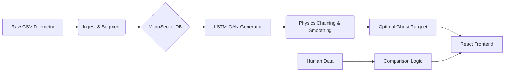
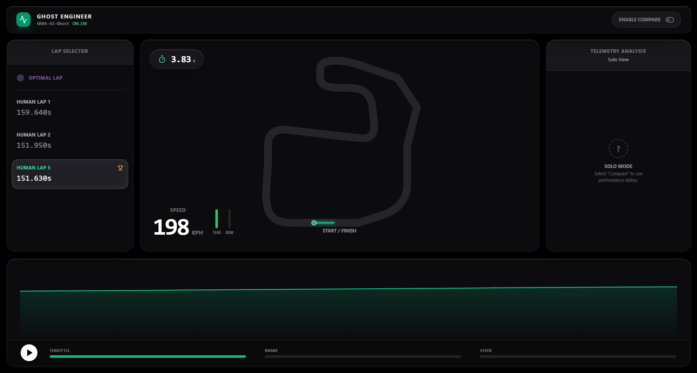
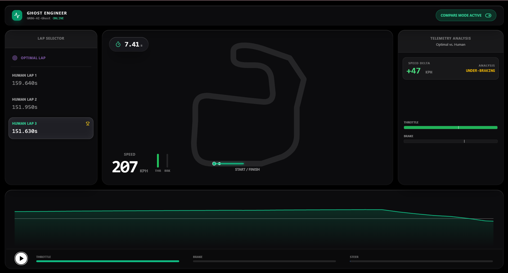

<div align="center">

  <h1>🏎️ GHOST ENGINEER</h1>
  <h3>AI-Powered Racing Telemetry Synthesis & Analysis</h3>

  <p>
    <strong>Generative Adversarial Networks (GANs)</strong> meet <strong>High-Performance Driving</strong>.
    <br />
    Ghost Engineer synthesizes the mathematically "Optimal Lap" based on historical telemetry and uses it to coach human drivers in real-time.
  </p>

  <p>
    <a href="#-features">Features</a> •
    <a href="#-architecture">Architecture</a> •
    <a href="#-getting-started">Getting Started</a> •
    <a href="#-tech-stack">Tech Stack</a>
  </p>

  
  
  
  
  

</div>

<br />

## 📖 Overview

Traditional racing telemetry tools are boring. They show you squiggly lines and expect you to be a data scientist.

**Ghost Engineer** changes the paradigm. Instead of comparing you to a theoretical math calculation, it uses an **LSTM-GAN (Long Short-Term Memory Generative Adversarial Network)** to "imagine" what a perfect lap looks like on a specific track. It breaks the track into "MicroSectors," generates the optimal driving line for each sector using trained neural networks, and stitches them together into a coherent **Ghost Lap**.

The result? A visual, interactive dashboard where you can race against the AI Ghost and get plain-English insights on where you are losing time.

---

## ✨ Features

### 🧠 The "Liquid" Engine
*   **Physics-Aware GANs:** The AI doesn't just draw lines; it understands momentum. It uses "Physics Chaining" to ensure entry speeds match exit speeds between track sectors.
*   **MicroSector Architecture:** The track is segmented into `Turn`, `Straight`, and `Braking` zones. Different specialized AI models generate telemetry for each specific zone type.
*   **Organic Smoothing:** Implementation of Savitzky-Golay filtering to mimic the physical inertia of a 1,200kg car, preventing robotic inputs.

### 📊 The Dashboard
*   **Real-Time Simulation:** A 60FPS loop visualizes the race between the Ghost and the Human driver on an SVG track map.
*   **Distance-Based Integration:** dots on the map move based on physical speed integration ($d = v \times t$), not just video playback time.
*   **Heads-Up Display (HUD):** Live visualization of Throttle, Brake, Speed, and G-Forces.
*   **Compare Mode:** Toggle instantly between "Solo Mode" and "Compare Mode" to overlap telemetry traces.

### 💡 Automated Insights
*   **Plain English Coaching:** Instead of raw deltas, the system outputs verdicts like *"Braking Too Early"* or *"Hesitant Throttle Application."*
*   **Input Comparator:** Visual bars showing exactly how much brake/throttle you applied vs. the optimal target.

---

## 🏗️ Architecture

Ghost Engineer operates on a strict ETL and Inference pipeline:



1.  **Ingestion:** Raw telemetry is pivoted from Long format to Wide format, resampled to 100Hz, and normalized.
2.  **Segmentation:** The track is sliced into hundreds of micro-sectors based on physics thresholds.
3.  **Synthesis:**
    *   The **Generator** creates raw normalized telemetry.
    *   **Physics Chaining** ensures the car doesn't "teleport" speeds between sectors.
    *   **Unit Correction** maps the GAN's latent space back to real-world KPH/Bar.
4.  **Presentation:** FastAPI serves the data to a React frontend using Recharts and Framer Motion.

---

## 🚀 Getting Started

### Prerequisites
*   Docker & Docker Compose
*   (Optional) Python 3.10 for local script debugging

### Installation

1.  **Clone the Repository**
    ```bash
    git clone https://github.com/yourusername/ghost-engineer.git
    cd ghost-engineer
    ```

2.  **Launch the Stack**
    ```bash
    docker-compose up -d --build
    ```
    *This starts Postgres, MLFlow, FastAPI (Backend), and Nginx (Frontend).*

### The Data Pipeline (Important)

The database starts empty. You must run the AI pipeline to generate the Ghost and process the Human laps.

**1. Generate the Optimal Ghost (AI Inference)**
```bash
docker-compose exec backend python /scripts/synthesize_lap.py
```

**2. Extract Human Laps (From Raw Data)**
```bash
docker-compose exec backend python /scripts/generate_real_lap.py
```

**3. Register Laps in Database**
```bash
docker-compose exec backend python /scripts/register_laps_db.py
```

### Access the App
*   **Frontend:** [http://localhost:5173](http://localhost:5173)
*   **Backend API:** [http://localhost:8000/docs](http://localhost:8000/docs)
*   **MLFlow:** [http://localhost:5000](http://localhost:5000)

---

## 💻 Tech Stack

| Area | Technology | Usage |
| :--- | :--- | :--- |
| **Frontend** | React 19, Vite | UI Framework & Build Tool |
| **Styling** | Tailwind CSS, Framer Motion | "Liquid" Glassmorphism UI & Animations |
| **Visualization** | Recharts, SVG | Telemetry graphs and Track Mapping |
| **Backend** | FastAPI, Pydantic | API Layer & Data Validation |
| **Database** | PostgreSQL, SQLAlchemy | Metadata & Lap Registry storage |
| **ML Core** | PyTorch, Scikit-Learn | LSTM-GAN training and inference |
| **Data Ops** | Pandas, NumPy, SciPy | Signal processing and Parquet I/O |
| **Infra** | Docker Compose | Container orchestration |

---

## 📂 Project Structure

```text
Directory structure:
└── yashisthebatman-ghost/
    ├── readme.md
    ├── docker-compose.yml
    ├── LICENSE
    ├── requirements.txt
    ├── backend/
    │   ├── Dockerfile
    │   └── app/
    │       ├── __init__.py
    │       ├── database.py
    │       ├── main.py
    │       ├── models.py
    │       └── tests/
    │           └── test_main.py
    ├── data/
    │   └── processed/
    │       └── scaler.joblib
    ├── frontend/
    │   ├── README.md
    │   ├── Dockerfile
    │   ├── eslint.config.js
    │   ├── index.html
    │   ├── nginx.conf
    │   ├── package.json
    │   ├── postcss.config.js
    │   ├── tailwind.config.js
    │   ├── vite.config.js
    │   └── src/
    │       ├── App.css
    │       ├── App.jsx
    │       ├── index.css
    │       ├── main.jsx
    │       ├── components/
    │       │   ├── DashboardWidgets.jsx
    │       │   ├── TrackMap.jsx
    │       │   └── ui/
    │       │       └── GlassPane.jsx
    │       └── store/
    │           └── simulationStore.js
    └── scripts/
        ├── __init__.py
        ├── generate_real_lap.py
        ├── generate_session_laps.py
        ├── init_db.py
        ├── populate_db.py
        ├── process_telemetry.py
        ├── register_laps_db.py
        ├── synthesize_lap.py
        └── train_gan.py

```

---

## 📸 Screenshots

<div align="center">
  
  
</div>

> *Left: Solo Mode showing the HUD. Right: Comparison Mode showing Ghost overlay and Delta analysis.*

---

## ⚖️ License

Distributed under the MIT License. See `LICENSE` for more information.

---

<div align="center">
  <sub>Built with ❤️ by YashIsTheBatman</sub>
</div>
